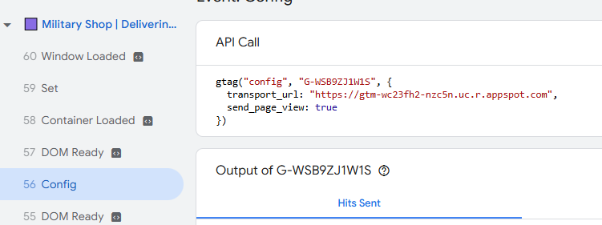
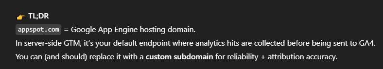

# Debugging Report

Traffic Attribution

The trigger is supposed to be initialization – all pages for smoother flow,

When Previewed the GA4 config are assigned to send the infos in the SGTM that been setup, 

Out of date server might also be one of the issues as it might deprecated some of its function

One thing to try is that in the image below there is a more setting there is a field name “cookies and client identification” set it into “Javascript Managed” by default it sets into “Server Managed” which is not good at accessing cookies that contain the info’s about attribution (source of the reasoning  at 18:00) the setting can be found at the Client tabs on the left

If None of the top works we might need to redo the setup of the server currently the server is setup its default is using App Engine by default but most common approach are hosting your own server container (like in stape.io) then proxy it to your GTM and some complex config that needed to be done, but after that all we need to do is to set the created SGTM url and pass it as a parameter in tags and it will do its thing

Benefits of server-side tracking:

Reduced load on a page

Control what kind of data is sent to vendors

Reduce the risk of PII leaks

Reduce the impact of ad blockers

Extend the cookie lifetime on Safari (ITP)

Server is not properly working so what we see in the GA is not trusting, the second image is the default behavior we can go back to the much easier but we lost some advantage of having a SGTM, 

I suggest that in the meantime we go to usual way while SGTM is on progress

## Tools Used

- **GA4**: Google Analytics 4 for web analytics and event tracking.
- **GTM**: Google Tag Manager for tag management and deployment.
- **stape.io**: Platform for hosting and managing server-side GTM containers.

