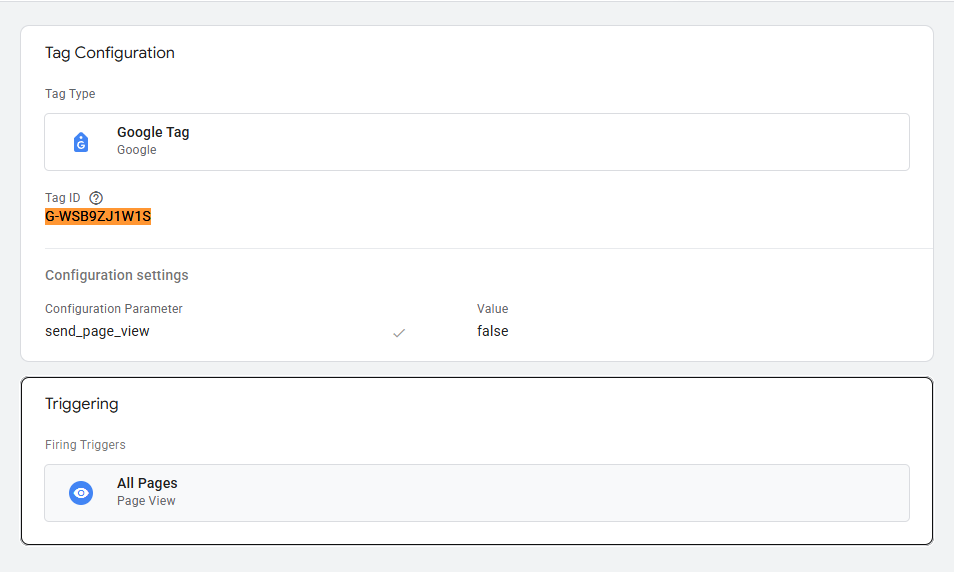
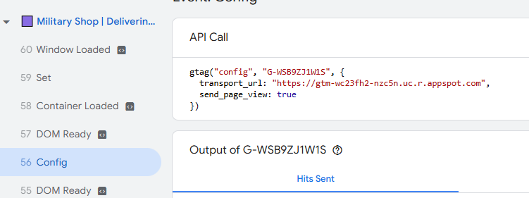
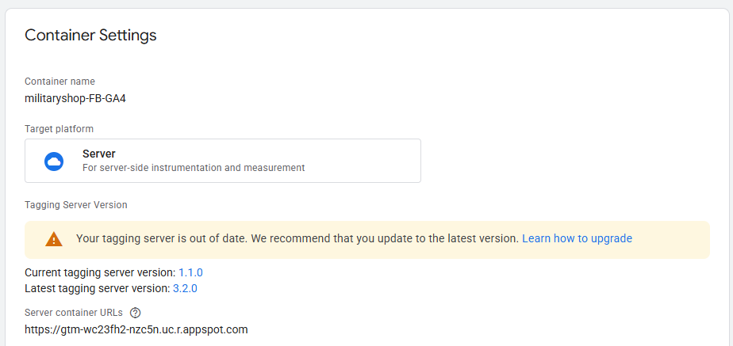
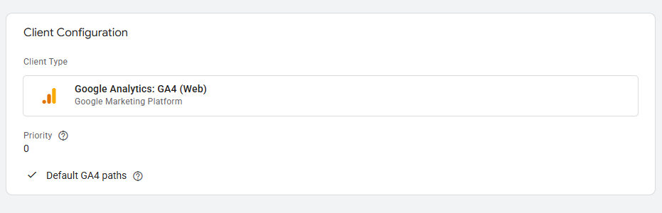
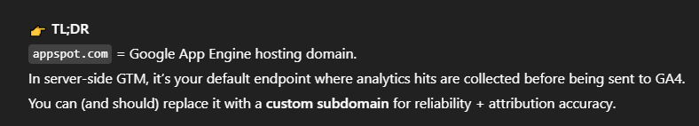
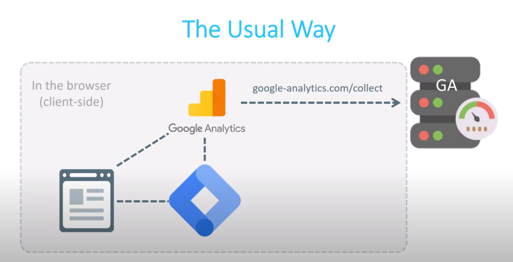

# Traffic Attribution Debugging Report

## Issues Identified

- The trigger is supposed to initialize on all pages for smoother flow.
- When previewed, GA4 configurations are assigned to send information to the SGTM that has been set up.
- An outdated server might have deprecated some functions.

## Recommended Fixes

### Change Cookie Settings

One potential fix is to adjust the cookie and client identification settings. In the image below, locate the "Cookies and Client Identification" field and set it to "JavaScript Managed" (default is "Server Managed"). This allows better access to cookies containing attribution information.

Reference: [YouTube Video](https://www.youtube.com/watch?v=vm8u4BckuRI) at 18:00.

### Server-Side Setup

If the above does not work, consider redoing the server setup. Currently, it uses App Engine by default, but a common approach is to host your own server container (e.g., via stape.io) and proxy it to GTM. After configuration, set the created SGTM URL as a parameter in tags.

## Benefits of Server-Side Tracking

- Reduced load on the page
- Control over data sent to vendors
- Reduced risk of PII leaks
- Reduced impact of ad blockers
- Extended cookie lifetime on Safari (ITP)

## Current Status and Recommendation

The server is not functioning properly, leading to untrustworthy data in GA4. The second image shows default behavior.

I recommend reverting to the standard tracking method temporarily while SGTM setup is in progress.

## Additional Images

